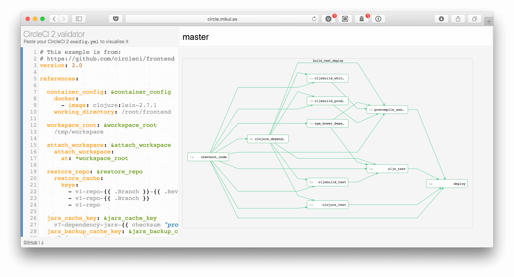

# CircleCI 2 visualisation

## [circle.mikul.as](https://circle.mikul.as)

For anybody who is struggling managing a complex CircleCI 2 config. And anybody who needs to migrate to CircleCI 2 _this week_!
See Circle CI workflows and preview them in different branches.

